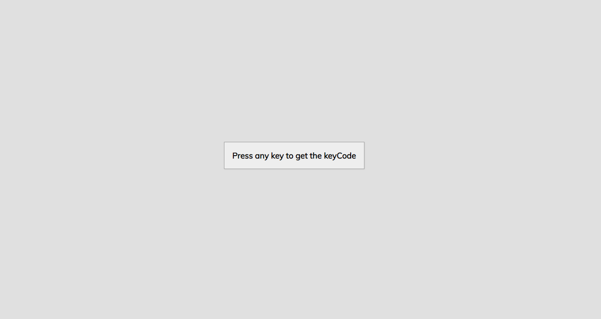

# Event Key Code



## 🦉 Main information

Simple application that shows you the key code and the code for any key on the keyboard.

The project goal:
- the user hits to any letter, for example L, it will show the actual key which is L, the keycode 76 and the code which is key L
- check if e.key equal an empty string, then it shows the word 'space'
- set up in HTML, style it with CSS and add the functionality with JavaScript

## 🦊 Useful links 

KeyboardEvent.keyCode

```
https://developer.mozilla.org/en-US/docs/Web/API/KeyboardEvent/keyCode
```

## ⚡ Built With
[HTML5](https://www.w3schools.com/html/) / [CSS3](https://www.w3schools.com/css/) / [JavaScript](https://www.w3schools.com/js/)
